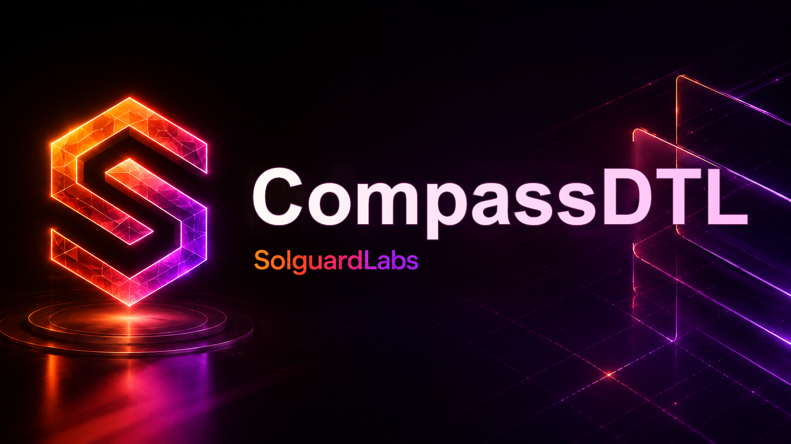

# CompassDTL



CompassDTL es una API Go para routing financiero DTL orientada a mesas de
liquidacion, operadores de tesoreria y proveedores de liquidez que necesitan
seleccionar rutas segun prioridad, coste, exposicion y capacidad operativa.

El motor modela intents de pago, rutas multiproveedor, limites economicos,
fees, reservas de liquidez y ejecucion por prioridad. Los tests de integracion
ejecutan escenarios completos desde TypeScript contra el binario Go.

## Componentes

- `src/domain`: tipos de negocio, validaciones y contratos JSON.
- `src/ledger`: balances, reservas, diario contable y snapshots.
- `src/risk`: limites por ruta, corredor, contraparte y epoch operativo.
- `src/routing`: scoring, seleccion de rutas y construccion de planes.
- `src/settlement`: cola priorizada, ejecucion y recibos de liquidacion.
- `src/api`: servicio de aplicacion y handlers HTTP.
- `src/scenario`: runner determinista para fixtures de auditoria.

## Requisitos

- Go 1.22 o superior.
- Node.js 22 o superior.
- npm 10 o superior.

## Uso

Instalar dependencias de tests:

```bash
npm install
```

Ejecutar un escenario:

```bash
go run ./cmd/compassdtl run tests/fixtures/priority_settlement.json
```

Levantar la API HTTP local:

```bash
go run ./cmd/compassdtl serve --addr 127.0.0.1:8087
```

Ejecutar tests:

```bash
npm test
```

Validacion completa:

```bash
bash scripts/ci.sh
```

## API

- `POST /v1/intents`: registra un intent y devuelve un ticket enrutable.
- `POST /v1/execute`: ejecuta tickets pendientes segun prioridad.
- `GET /v1/snapshot`: expone balances, rutas, limites, cola y eventos.
- `POST /v1/reconcile/exposure`: aplica ajustes de exposicion operativa.

Todos los importes se expresan como enteros en unidades menores del activo. La
configuracion de fixtures usa activos estables con precision homogenea para
mantener los escenarios auditables y repetibles.

## Estado Del Lab

CompassDTL esta preparado como laboratorio de auditoria de logica economica.
El repositorio no requiere servicios externos para compilar ni para ejecutar la
suite de tests.
