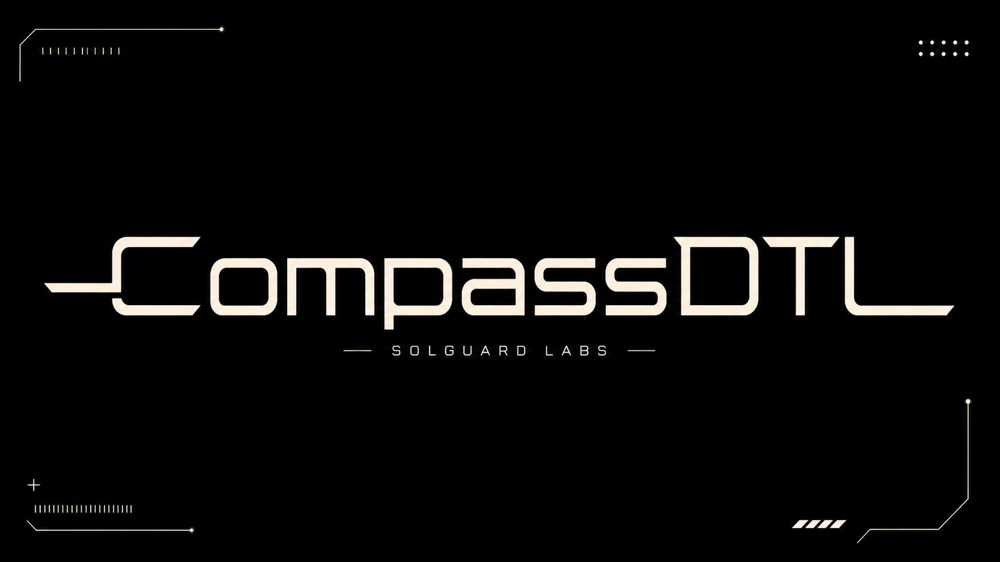
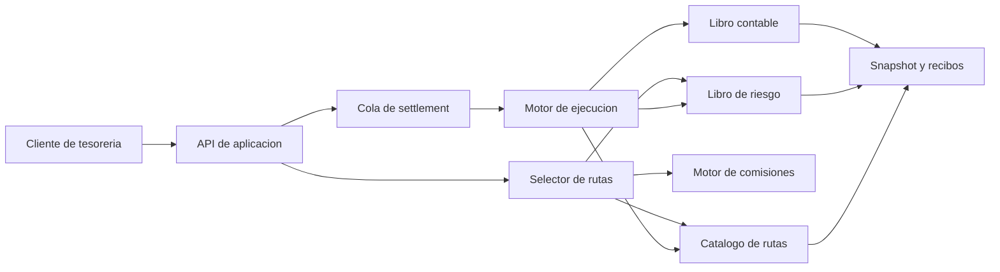
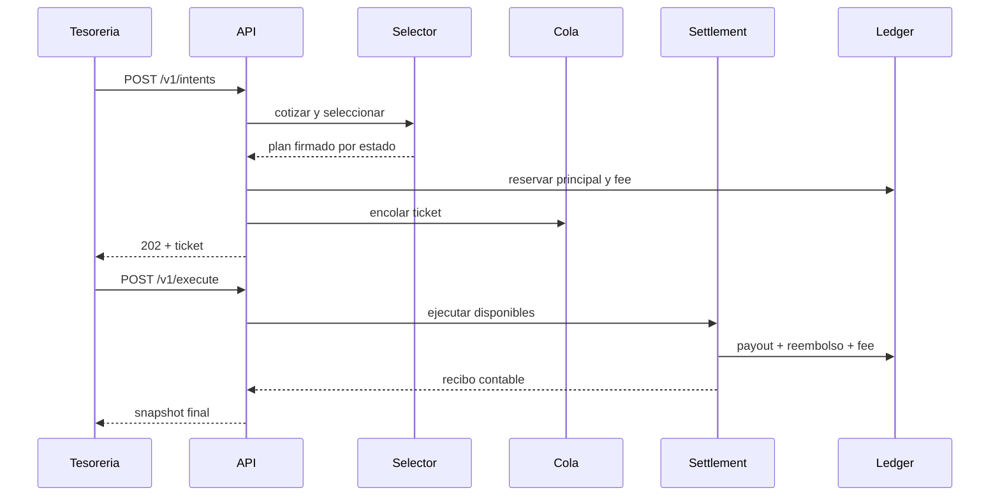
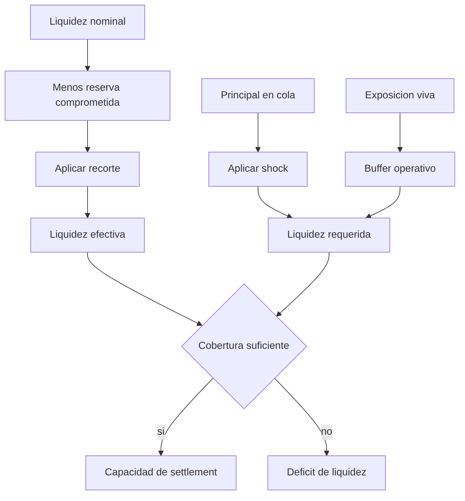
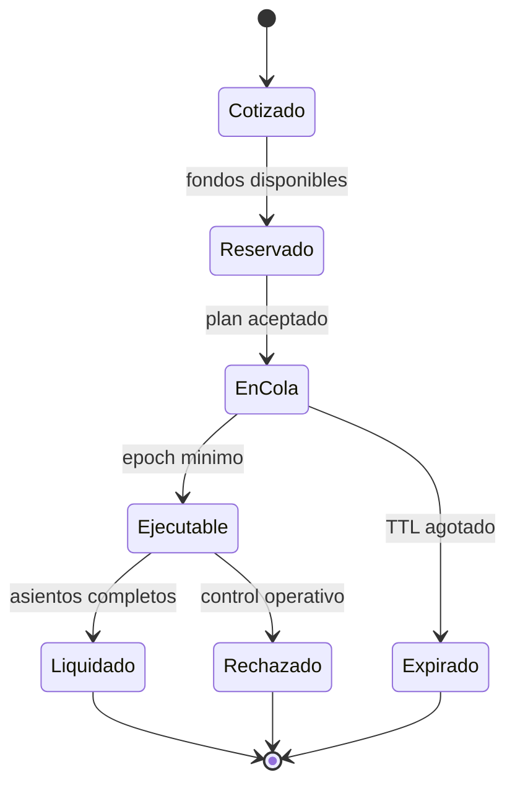

# CompassDTL



CompassDTL es un motor de enrutamiento y liquidacion DTL para coordinar intents
de pago entre tesorerias, corredores y proveedores de liquidez. La plataforma
selecciona rutas por coste, latencia, capacidad y exposicion; reserva fondos;
ordena tickets por prioridad; ejecuta asientos contables; y emite recibos
deterministas para conciliacion.

Los importes se representan como enteros en unidades menores. Go mantiene el
estado economico y el SDK TypeScript aporta integracion segura y calculos de
capital con precision arbitraria.

## Capacidades

- seleccion multicriterio de rutas y corredores;
- reservas contables de principal y comisiones;
- cola estable por prioridad, score, disponibilidad y secuencia;
- limites de exposicion por ruta, corredor y volumen diario;
- modelo de capital con recortes, shocks, buffers y capacidad disponible;
- metricas de concentracion HHI y vencimiento ponderado;
- gobierno diferido con quorum, timelock, expiracion y predecesores;
- API JSON endurecida y SDK TypeScript con idempotencia;
- escenarios deterministas y validacion en Linux y Windows.

## Arquitectura


```mermaid
flowchart LR
    C["Cliente de tesoreria"] --> API["API de aplicacion"]
    API --> SEL["Selector de rutas"]
    SEL --> CAT["Catalogo de rutas"]
    SEL --> RISK["Libro de riesgo"]
    SEL --> FEE["Motor de comisiones"]
    API --> QUEUE["Cola de settlement"]
    QUEUE --> ENG["Motor de ejecucion"]
    ENG --> LEDGER["Libro contable"]
    ENG --> RISK
    ENG --> CAT
    LEDGER --> SNAP["Snapshot y recibos"]
    RISK --> SNAP
    CAT --> SNAP
```


```mermaid
sequenceDiagram
    participant T as Tesoreria
    participant A as API
    participant S as Selector
    participant Q as Cola
    participant E as Settlement
    participant L as Ledger
    T->>A: POST /v1/intents
    A->>S: cotizar y seleccionar
    S-->>A: plan firmado por estado
    A->>L: reservar principal y fee
    A->>Q: encolar ticket
    A-->>T: 202 + ticket
    T->>A: POST /v1/execute
    A->>E: ejecutar disponibles
    E->>L: payout + reembolso + fee
    E-->>A: recibo contable
    A-->>T: snapshot final
```

## Modelo Economico

Para una ruta con liquidez `L`, reserva comprometida `R`, recorte `h`,
principal en cola `Q`, shock `s`, exposicion `E` y buffer `b`:

```text
liquidez_disponible = L - R
liquidez_efectiva = floor(liquidez_disponible * (10_000 - h) / 10_000)
salidas_estresadas = ceil(Q * (10_000 + s) / 10_000)
buffer_operativo = ceil(E * b / 10_000)
liquidez_requerida = salidas_estresadas + buffer_operativo
deficit = max(0, liquidez_requerida - liquidez_efectiva)
capacidad = min(max(0, liquidez_efectiva - liquidez_requerida), max(0, limite - E))
```


```mermaid
flowchart TD
    L["Liquidez nominal"] --> A["Menos reserva comprometida"]
    A --> H["Aplicar recorte"]
    H --> EL["Liquidez efectiva"]
    Q["Principal en cola"] --> S["Aplicar shock"]
    E["Exposicion viva"] --> B["Buffer operativo"]
    S --> RL["Liquidez requerida"]
    B --> RL
    EL --> C{"Cobertura suficiente"}
    RL --> C
    C -->|"si"| CAP["Capacidad de settlement"]
    C -->|"no"| DEF["Deficit de liquidez"]
```

La cartera agrega las rutas, calcula cobertura por corredor y mide la
concentracion de exposicion:

```text
share_i = exposicion_i / exposicion_total
HHI = sum(share_i^2) * 10_000
```

Todos los redondeos que incrementan necesidades se realizan hacia arriba; los
que reconocen recursos o capacidad, hacia abajo.

## Ciclo De Un Ticket


```mermaid
stateDiagram-v2
    [*] --> Cotizado
    Cotizado --> Reservado: fondos disponibles
    Reservado --> EnCola: plan aceptado
    EnCola --> Ejecutable: epoch minimo
    EnCola --> Expirado: TTL agotado
    Ejecutable --> Liquidado: asientos completos
    Ejecutable --> Rechazado: control operativo
    Liquidado --> [*]
    Expirado --> [*]
    Rechazado --> [*]
```

## Inicio Rapido

Requisitos:

- Go 1.22.12 o compatible;
- Node.js 24;
- npm 11 o compatible.

Instalacion y validacion:

```bash
npm ci
npm run ci
```

Ejecutar un escenario:

```bash
go run ./cmd/compassdtl run tests/fixtures/priority_settlement.json
```

Levantar la API local:

```bash
go run ./cmd/compassdtl serve --addr 127.0.0.1:8087
```

Obtener la configuracion de referencia:

```bash
go run ./cmd/compassdtl snapshot-default
```

## API

| Metodo | Ruta                     | Proposito                                |
| ------ | ------------------------ | ---------------------------------------- |
| `GET`  | `/healthz`               | salud y epoch                            |
| `GET`  | `/v1/snapshot`           | balances, rutas, cola, recibos y eventos |
| `POST` | `/v1/quotes`             | cotizaciones elegibles                   |
| `POST` | `/v1/intents`            | reserva y alta de ticket                 |
| `POST` | `/v1/execute`            | ejecucion de tickets disponibles         |
| `POST` | `/v1/reconcile/exposure` | ajuste operativo de exposicion           |
| `POST` | `/v1/routes`             | cambio controlado de una ruta            |
| `POST` | `/v1/epoch`              | avance determinista de epoch             |

Ejemplo de intent:

```json
{
  "intent": {
    "id": "intent:treasury-2026-001",
    "sourceAccount": "acct:alice",
    "destinationAccount": "acct:bob",
    "sourceAsset": "usdc",
    "destinationAsset": "eurc",
    "amount": 100000,
    "maxFee": 500,
    "priority": "urgent"
  }
}
```

El servidor limita cuerpos a 1 MiB, rechaza campos desconocidos y documentos
JSON concatenados, aplica timeouts y devuelve cabeceras defensivas. Las
operaciones de escritura deben llevar una clave de idempotencia en el cliente.

## SDK TypeScript

```ts
import { CompassClient, computeRouteCapital } from "./sdk/compassClient.ts";

const client = new CompassClient("https://compass.internal.example/api/");
const snapshot = await client.snapshot();

const capital = computeRouteCapital({
  liquidity: 1_000_000n,
  reservedLiquidity: 100_000n,
  exposure: 400_000n,
  maxExposure: 900_000n,
  queuedPrincipal: 300_000n,
  liquidityHaircutBps: 500n,
  settlementShockBps: 2_000n,
  operationalBufferBps: 800n,
});
```

El SDK exige HTTPS fuera de localhost, omite credenciales, rechaza redirects,
limita el tamaño de respuesta y serializa `bigint` como decimal exacto.

## Documentacion

- [Arquitectura](./docs/01-arquitectura.md)
- [Modelo economico](./docs/02-modelo-economico.md)
- [Seguridad operativa](./docs/03-seguridad-operativa.md)
- [API y SDK](./docs/04-api-sdk.md)
- [Operacion](./docs/05-operacion.md)
- [Gobernanza](./docs/06-gobernanza.md)
- [Observabilidad](./docs/07-observabilidad.md)

## Estructura

```text
cmd/                 CLI y servidor
sdk/                 cliente TypeScript y paridad matematica
src/api/             contrato HTTP y servicio
src/capital/         capital, stress y concentracion
src/domain/          tipos e invariantes basicas
src/governance/      operaciones diferidas
src/ledger/          reservas y diario contable
src/observability/   indicadores de snapshots
src/risk/            limites y exposicion
src/routing/         catalogo, scoring y seleccion
src/settlement/      cola, ejecucion y recibos
src/scenario/        escenarios deterministas
tests/               contratos funcionales y de distribucion
```

## Calidad De Entrega

`npm run ci` comprueba formato, tipos, `go vet`, pruebas Go y Node.js,
compilacion, identidad visual, documentacion, diagramas y dependencias. La rama
`production` y la etiqueta anotada `v1.0.0` deben resolver al mismo commit que
`main`; la automatizacion de integridad valida esa relacion en cada entrega.

## Licencia

MIT. Consulte [LICENSE](./LICENSE).
