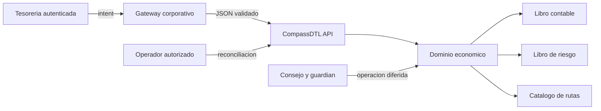
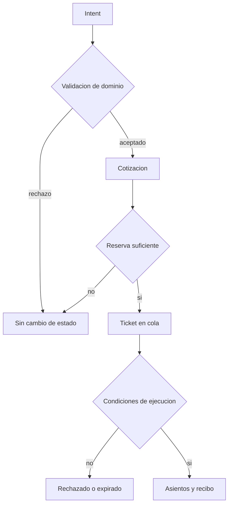
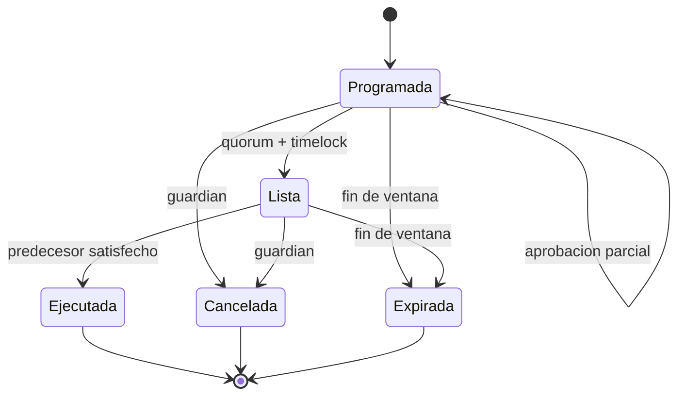
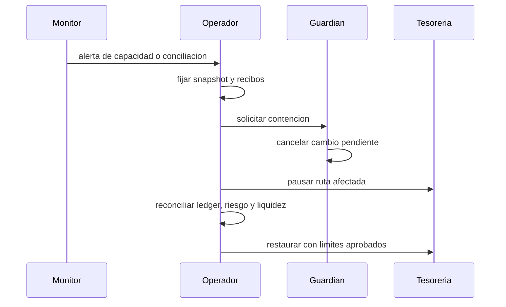

# Seguridad De CompassDTL

CompassDTL procesa reservas, exposicion y pagos diferidos. Su modelo de
seguridad prioriza autorizacion explicita, contabilidad de doble entrada,
limites conservadores y trazabilidad completa de cada cambio economico.

## Versiones Mantenidas

| Version   | Estado           |
| --------- | ---------------- |
| `1.0.x`   | mantenida        |
| `< 1.0.0` | fuera de soporte |

## Fronteras De Confianza



El gateway, la identidad corporativa y la terminacion TLS se consideran
servicios externos. El nucleo no confia en valores derivados por el cliente:
recalcula comisiones, valida identificadores y aplica limites enteros.

## Invariantes

- cada asiento conserva el activo y tiene contrapartida identificable;
- ningun balance disponible o reservado puede ser negativo;
- un ticket solo produce un recibo terminal;
- la suma de principal y comisiones reservadas coincide con el debito previsto;
- una ruta deshabilitada no admite nuevas solicitudes;
- los identificadores de intent, ticket, recibo y evento son unicos;
- los cambios de gobierno tienen dominio, red, payload, salt y ventana temporal;
- la capacidad reconocida nunca se redondea al alza;
- los requisitos de liquidez nunca se redondean a la baja.



## Controles HTTP

- HTTPS obligatorio en integraciones remotas del SDK;
- cuerpos limitados a 1 MiB;
- campos desconocidos y JSON adicional rechazados;
- timeouts de cabeceras, lectura, escritura e inactividad;
- limite de 32 KiB para cabeceras;
- respuestas `no-store` y protecciones de contenido y framing;
- redirects desactivados en el cliente;
- limite configurable del cuerpo de respuesta;
- claves de idempotencia para escrituras desde el SDK.

## Gobierno De Cambios



El identificador de operacion es SHA-256 sobre JSON canonico. Cambiar la red,
el target, el metodo, el payload, el salt o la ventana produce otro
identificador. Las aprobaciones se deduplican y se ordenan al exponer el
registro.

## Gestion De Secretos

El repositorio no contiene claves, tokens ni credenciales. Los despliegues
deben inyectarlos mediante el gestor de secretos de la plataforma y limitar su
alcance al entorno y accion requeridos. No se deben registrar cabeceras de
autorizacion, cuerpos completos de pagos ni material de firma.

## Respuesta Operativa



Prioridades:

1. conservar evidencia y el epoch exacto;
2. impedir nuevas admisiones en la ruta afectada;
3. detener ejecuciones pendientes cuando la politica operativa lo requiera;
4. reconciliar balances, reservas, exposicion y recibos;
5. aplicar el cambio mediante el proceso de gobierno;
6. validar invariantes antes de reabrir capacidad.

## Comunicacion Responsable

Los informes de seguridad deben enviarse mediante GitHub Security Advisories
del repositorio. Incluya:

- version y commit afectados;
- precondiciones y alcance economico;
- secuencia minima reproducible;
- invariante observada;
- activos, rutas y corredores implicados;
- propuesta de contencion y validacion.

No publique detalles tecnicos antes de que exista una version corregida y una
ventana razonable de actualizacion.

## Validacion Antes De Entrega

```bash
npm ci
npm run ci
```

La entrega requiere pruebas Go y TypeScript, `go vet`, formato, compilacion,
revision del contrato documental, auditoria de dependencias y coherencia entre
`main`, `production`, la etiqueta anotada y la release.
