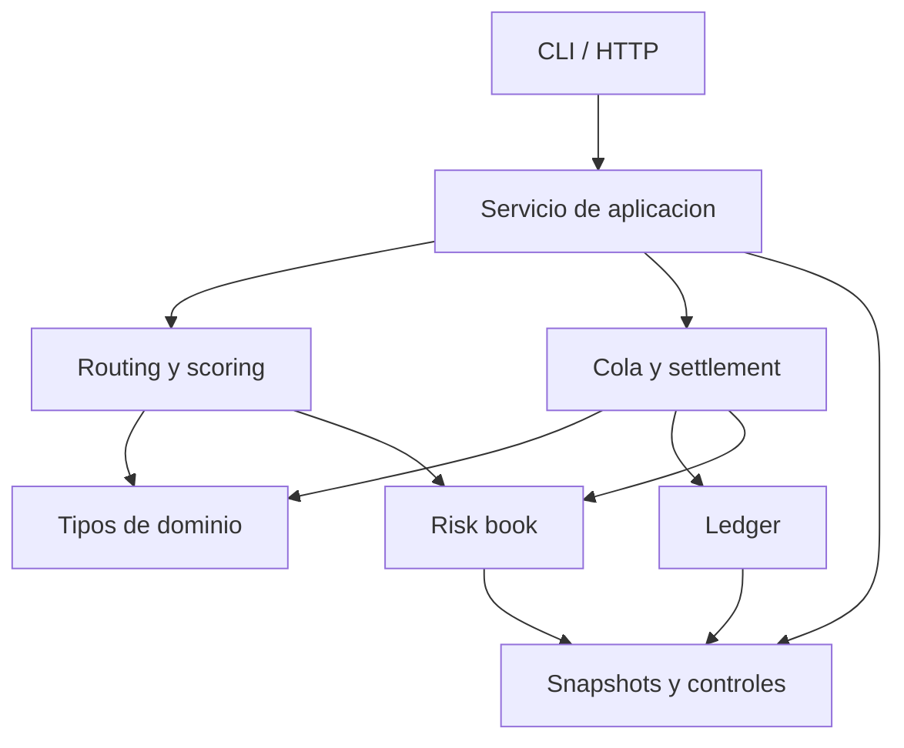
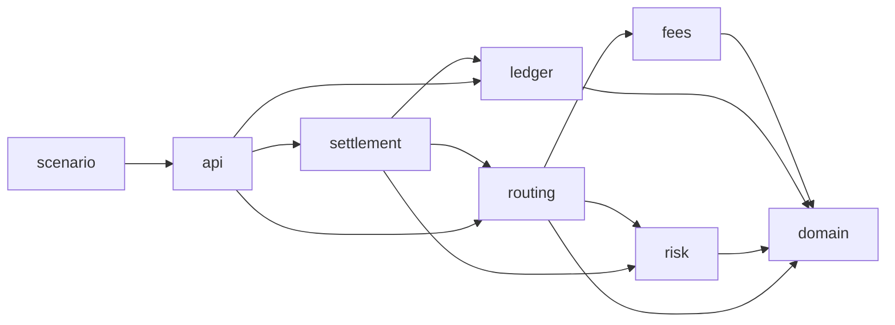
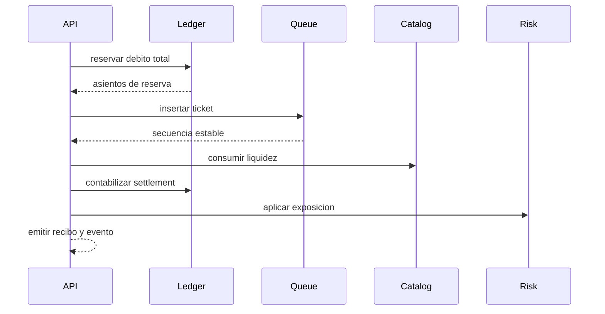

# Arquitectura

CompassDTL separa dominio, contabilidad, riesgo, seleccion, ejecucion y
presentacion. Esta division permite validar cada frontera con datos
deterministas y evita que los handlers HTTP contengan reglas economicas.

## Capas

| Paquete         | Responsabilidad                  | Estado principal |
| --------------- | -------------------------------- | ---------------- |
| `domain`        | contratos, IDs, importes, planes | tipos inmutables |
| `ledger`        | disponible, reservado, asientos  | saldos y diario  |
| `risk`          | limites y exposicion             | ruta y corredor  |
| `routing`       | candidatos, fee y score          | catalogo         |
| `settlement`    | cola, pago y recibo              | tickets          |
| `capital`       | stress y capacidad               | calculos puros   |
| `governance`    | cambios diferidos                | operaciones      |
| `observability` | indicadores derivados            | snapshots        |

## Dependencias

Los paquetes `capital`, `governance` y `observability` no dependen de la capa
HTTP. Pueden ejecutarse en procesos de control, tareas programadas o pipelines
de aprobacion sin duplicar reglas.

## Consistencia De Estado

El servicio serializa las operaciones de aplicacion por epoch. Los libros de
ledger y riesgo protegen sus mapas internos. La cola mantiene orden estable y
el catalogo controla liquidez y estado por ruta.

## Contratos De Datos

- IDs normalizados y acotados a 64 caracteres en Go;
- importes `int64` positivos o no negativos segun contexto;
- JSON con nombres estables en camelCase;
- snapshots ordenados para comparacion determinista;
- recibos con referencias a ticket, intent, ruta y asientos;
- eventos con epoch, secuencia y campos adicionales controlados.

## Extensiones

Una integracion persistente debe implementar un adaptador alrededor de los
libros sin cambiar los contratos de dominio. Una integracion de identidad debe
autorizar antes de llamar al servicio y aportar un actor verificable a la capa
de auditoria. El nucleo no almacena sesiones ni secretos.
