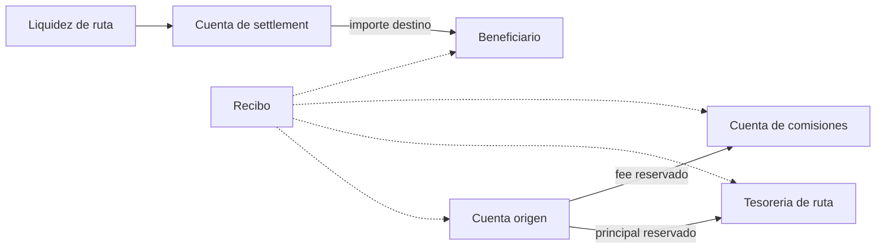
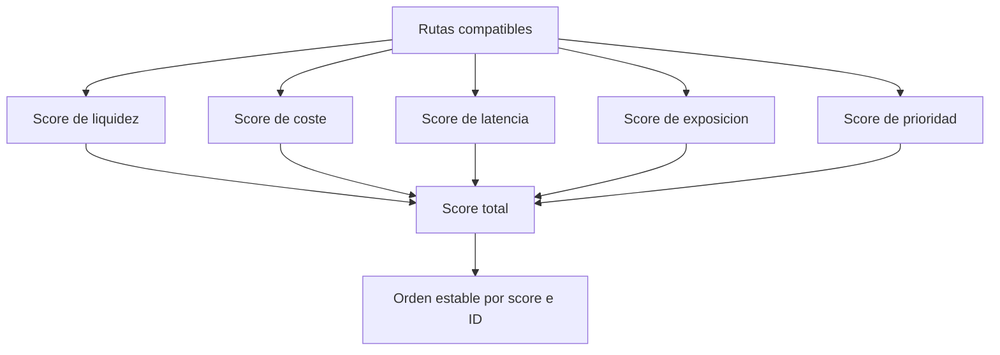
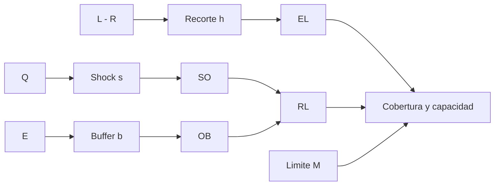

# Modelo Economico

CompassDTL coordina dos activos por ruta: el activo de origen reembolsa a la
tesoreria del proveedor y el activo de destino paga al beneficiario. Las
comisiones se cargan sobre el activo de origen.

## Flujo De Valor



El debito reservado es:

```text
debito_total = principal + fee_base + fee_operador + fee_red
```

Cada componente se calcula en enteros. `maxFee` establece el limite aceptado
por el originador.

## Score De Ruta

```text
score = liquidez + coste + latencia + exposicion + prioridad
```



El score ordena candidatos; los limites economicos determinan elegibilidad.
Un empate se resuelve por ID para mantener resultados reproducibles.

## Capital Por Ruta

Variables:

| Simbolo | Significado                |
| ------- | -------------------------- |
| `L`     | liquidez nominal           |
| `R`     | liquidez ya reservada      |
| `h`     | recorte de liquidez en bps |
| `Q`     | principal pendiente        |
| `s`     | shock de settlement en bps |
| `E`     | exposicion viva            |
| `b`     | buffer operativo en bps    |
| `M`     | exposicion maxima          |

```text
EL = floor((L - R) * (10_000 - h) / 10_000)
SO = ceil(Q * (10_000 + s) / 10_000)
OB = ceil(E * b / 10_000)
RL = SO + OB
coverage_bps = floor(EL * 10_000 / RL)
headroom = max(0, M - E)
capacity = min(max(0, EL - RL), headroom)
```



## Agregacion

La cartera suma recursos y requisitos, pero conserva cortes por corredor. La
concentracion se calcula con HHI:

```text
share_i = E_i / sum(E)
HHI_bps = floor(sum(share_i^2) * 10_000)
```

Referencias orientativas:

- `HHI < 1.500`: exposicion distribuida;
- `1.500 <= HHI < 2.500`: concentracion moderada;
- `HHI >= 2.500`: concentracion elevada.

Estos rangos son parametros de gestion, no garantias de solvencia. Deben
interpretarse junto con cobertura, liquidez, vencimiento y correlacion.

## Matriz De Stress

`BuildStressGrid` cruza recortes y shocks sin usar coma flotante. Un escenario
mas severo no debe aumentar capacidad ni cobertura si el resto permanece fijo.
La matriz se usa para limites preventivos y planificacion de reservas.
