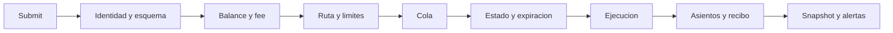
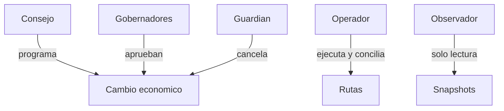
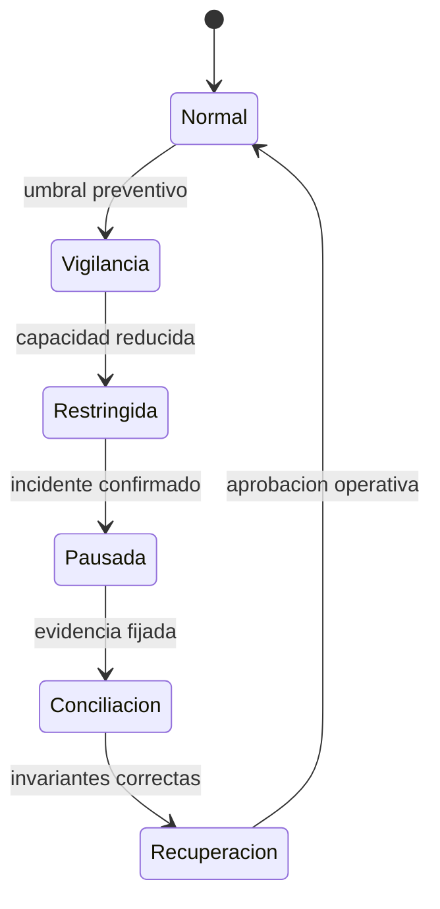

# Seguridad Operativa

La operacion segura combina controles preventivos, limites, conciliacion y
capacidad de contencion. Ningun indicador aislado sustituye la revision del
ledger, el libro de riesgo y los recibos.

## Controles Por Fase

| Fase      | Entrada   | Control                      | Evidencia      |
| --------- | --------- | ---------------------------- | -------------- |
| submit    | intent    | esquema, cuenta, activo, fee | ticket         |
| reserva   | principal | disponible suficiente        | asientos       |
| cola      | plan      | score, secuencia, TTL        | queue snapshot |
| ejecucion | ticket    | estado, ruta, liquidez       | recibo         |
| cierre    | asientos  | conciliacion                 | snapshot       |

## Roles

- consejo: define quorum y ventanas;
- gobernador: aprueba operaciones con identidad unica;
- guardian: cancela operaciones no terminales con motivo;
- operador: administra rutas y reconciliaciones autorizadas;
- observador: consume salud, snapshots y metricas.

## Contencion

Una pausa debe conservar la capacidad de inspeccionar snapshots y recibos.
No se deben borrar eventos ni recrear el estado sin un punto de conciliacion.

## Lista De Apertura

- `main`, `production` y tag resuelven al commit aprobado;
- CI verde en Linux y Windows;
- configuracion revisada con limites no nulos;
- cuentas de tesoreria y settlement presentes;
- liquidez nominal reconciliada con balances;
- claves de idempotencia habilitadas en el cliente;
- timeouts y limites HTTP aplicados;
- alertas de exposicion, cola y deficit activas;
- guardian y quorum verificados.

## Lista De Cierre

- no quedan tickets fuera de su ventana;
- todos los recibos enlazan asientos conocidos;
- principal reservado coincide con la cola;
- exposicion por ruta y corredor esta reconciliada;
- no existen balances negativos;
- los cambios pendientes tienen estado terminal o ventana vigente;
- el snapshot final queda almacenado con commit y epoch.
