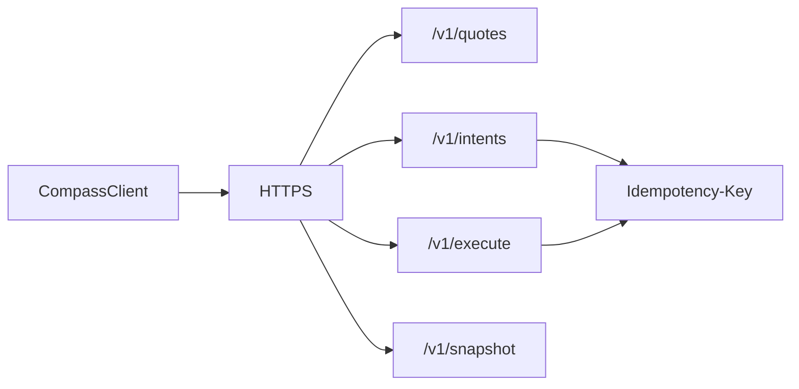
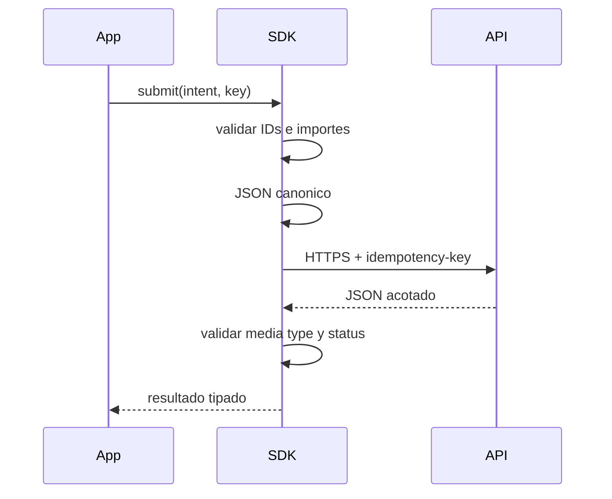

# API Y SDK

La API usa JSON y unidades enteras. El SDK conserva importes como `bigint` y
los serializa como decimales para impedir perdida de precision en clientes.

## Superficie



### Cotizar

```http
POST /v1/quotes
content-type: application/json
accept: application/json
```

La respuesta contiene todas las rutas elegibles ordenadas por score.

### Registrar intent

```http
POST /v1/intents
content-type: application/json
idempotency-key: treasury-batch-2026-001
```

Una aceptacion devuelve HTTP `202` con ticket y cotizacion.

### Ejecutar

```json
{
  "count": 10
}
```

`count` queda acotado por el cliente. La respuesta incluye recibos, tickets
omitidos y snapshot posterior.

## Comportamiento Del Cliente



El cliente:

- rechaza HTTP remoto;
- rechaza credenciales en la URL base;
- desactiva cache, credenciales y redirects;
- limita tiempo y tamaño de respuesta;
- exige `application/json`;
- expone status, texto y cuerpo de errores HTTP;
- permite cancelar mediante `AbortSignal`.

## Hash Canonico

```ts
import { canonicalJSON, payloadHash } from "../sdk/compassClient.ts";

const body = { routeId: "route:atlantic-fast", maxExposure: 900_000n };
const encoded = canonicalJSON(body);
const digest = payloadHash(body);
```

Las claves se ordenan de forma recursiva y `bigint` se convierte a decimal.
El hash resultante puede incorporarse a una operacion de gobierno.

## Errores

| Status | Significado operativo                   |
| ------ | --------------------------------------- |
| `400`  | esquema o campo invalido                |
| `404`  | cuenta, activo, ruta o endpoint ausente |
| `409`  | conflicto, limite, liquidez o estado    |
| `500`  | error interno no clasificado            |

No se deben reintentar escrituras `409` sin volver a evaluar el estado. Los
reintentos de red deben conservar la misma clave de idempotencia.
