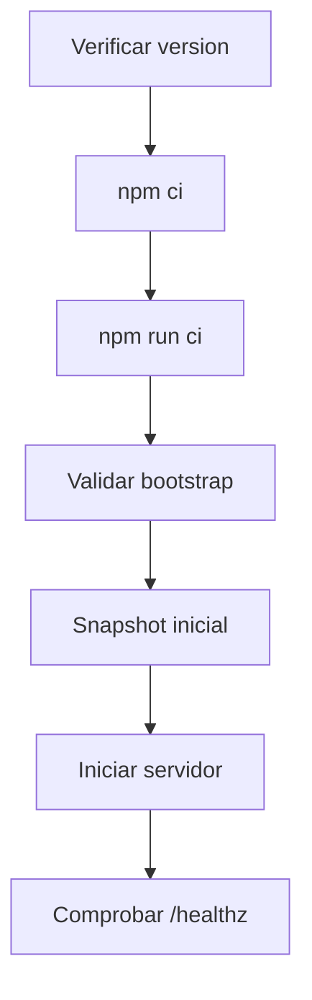
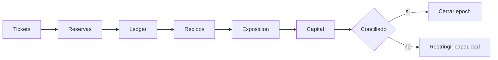

# Operacion

Este documento define el arranque, la conciliacion y el cierre de CompassDTL.

## Arranque



Comandos:

```bash
npm ci
npm run ci
go run ./cmd/compassdtl snapshot-default
go run ./cmd/compassdtl serve --addr 127.0.0.1:8087
```

La direccion por defecto solo escucha en loopback. La exposicion remota debe
realizarse tras un gateway con TLS, autenticacion y limites de peticion.

## Conciliacion

Para cada epoch:

1. capturar snapshot;
2. sumar saldos disponibles y reservados por activo;
3. enlazar cada recibo con ticket e intent;
4. comparar principal en cola con reservas del originador;
5. comparar exposicion de ruta y corredor;
6. revisar capacidad, cobertura, HHI y antiguedad de cola;
7. almacenar commit, epoch y hash del snapshot.



## Backups

El proceso actual es en memoria. Una integracion persistente debe capturar:

- bootstrap efectivo;
- secuencia de eventos;
- asientos contables;
- tickets y recibos;
- catalogo y limites;
- operaciones de gobierno.

Los backups deben cifrarse, probar restauracion y conservar una politica de
retencion definida por el operador.

## Cierre Ordenado

Antes de detener una instancia:

- retirar trafico nuevo;
- esperar solicitudes en curso;
- congelar avance de epoch;
- capturar snapshot y metricas;
- conciliar reservas y recibos;
- registrar tickets pendientes;
- cerrar el proceso dentro del timeout operativo.

La nueva instancia debe arrancar desde un estado reconciliado, nunca desde una
mezcla parcial de ledger y libro de riesgo.
