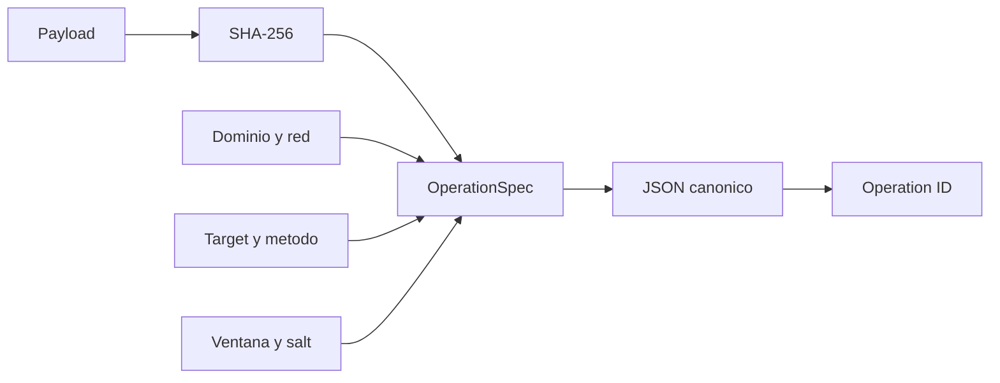
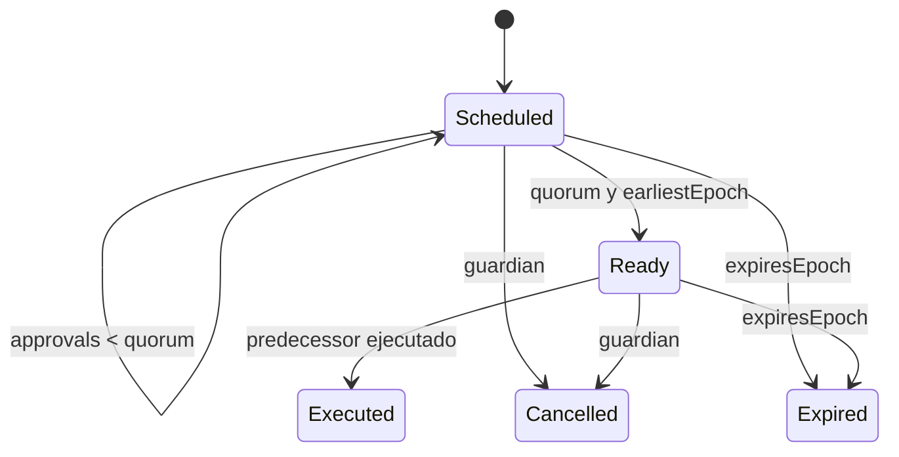

# Gobernanza

Los cambios de limites, rutas y parametros economicos se representan como
operaciones con identidad canonica y ventana temporal.

## Identidad

```text
operation_id = SHA256(JSON_canonico(spec))
```

`spec` contiene:

- dominio de aplicacion;
- identificador de red;
- target y metodo;
- SHA-256 del payload;
- salt unico;
- epoch minimo y expiracion;
- predecesor opcional.



La separacion por dominio y red impide reutilizar la misma aprobacion en otro
entorno. El salt separa cambios con payload identico.

## Estados



Reglas:

- solo un gobernador puede programar o aprobar;
- el proponente aporta la primera aprobacion;
- una identidad cuenta una sola vez;
- el timelock debe transcurrir aunque exista quorum;
- un predecesor debe estar ejecutado;
- el guardian solo cancela estados no terminales;
- ejecutar, cancelar o expirar es terminal.

## Ejemplo

```go
spec := governance.OperationSpec{
    Domain:        "compass.governance.v1",
    ChainID:       "settlement-eu-1",
    Target:        "route:atlantic-fast",
    Method:        "set_route_limit",
    PayloadHash:   governance.HashPayload(payload),
    Salt:          "limit-2026-08",
    EarliestEpoch: 120,
    ExpiresEpoch:  144,
}
```

## Ceremonia

1. generar y revisar payload;
2. calcular hash e ID por dos herramientas independientes;
3. programar con una ventana suficiente;
4. publicar impacto y plan de reversion internos;
5. reunir quorum con identidades distintas;
6. verificar predecesores y metricas;
7. ejecutar una vez;
8. fijar recibo, epoch y snapshot posterior.
