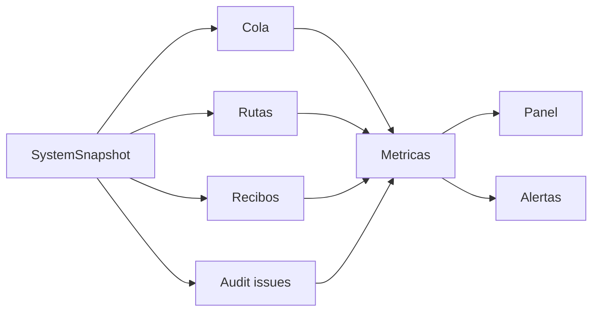
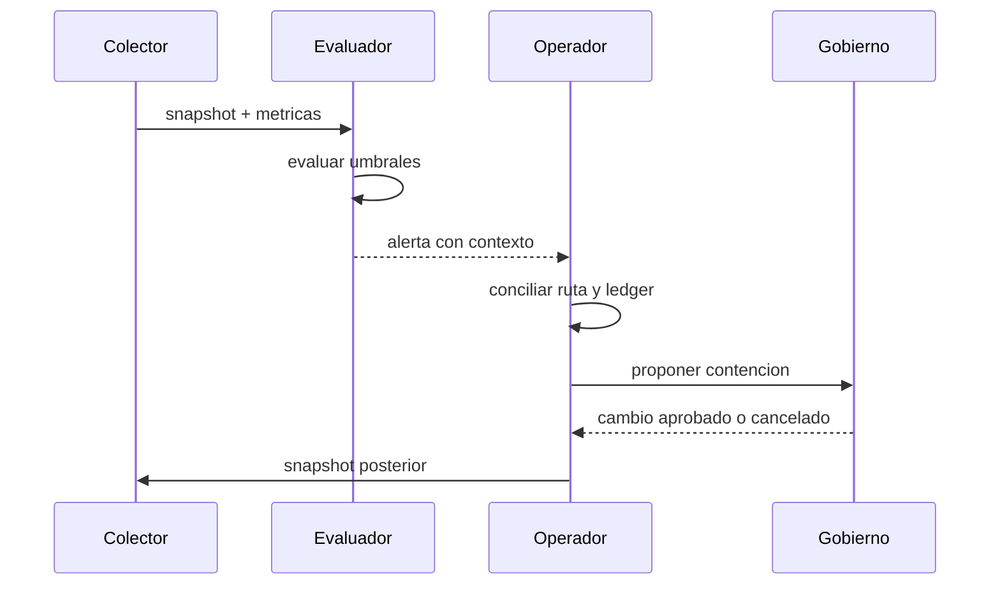

# Observabilidad

La observabilidad parte del snapshot economico, no de contadores aislados. Las
metricas deben poder reconciliarse con tickets, recibos y rutas.

## Indicadores

| Indicador           | Unidad           | Uso                         |
| ------------------- | ---------------- | --------------------------- |
| profundidad de cola | tickets          | carga pendiente             |
| principal en cola   | unidades menores | necesidad de settlement     |
| maxima antiguedad   | epochs           | riesgo operativo            |
| exposicion maxima   | bps              | proximidad a limite         |
| HHI de rutas        | bps              | concentracion               |
| cobertura           | bps              | recursos frente a requisito |
| deficit             | unidades menores | contencion inmediata        |

## Umbrales Sugeridos

| Condicion                 |          Aviso |          Critico |
| ------------------------- | -------------: | ---------------: |
| utilizacion de exposicion | `>= 7.500 bps` |   `>= 9.000 bps` |
| cobertura de liquidez     | `< 12.500 bps` |   `< 10.000 bps` |
| HHI                       | `>= 2.500 bps` |   `>= 4.000 bps` |
| antiguedad de cola        |   `>= TTL / 2` | `>= 3 * TTL / 4` |
| deficit                   |      no aplica |            `> 0` |

Los umbrales se ajustan por activo, corredor y horario. Una alerta debe incluir
epoch, route ID, commit y snapshot relacionado.

## Flujo De Alerta

## Reglas De Calidad

- no usar coma flotante para ratios economicos;
- conservar unidades y bps en el nombre;
- no mezclar epochs en una misma observacion;
- ordenar rutas antes de serializar;
- diferenciar valor cero de dato ausente;
- mantener cardinalidad acotada en labels;
- enlazar alertas con evidencia durable.

## SLO Operativo

Un objetivo razonable exige que los snapshots de salud esten disponibles, que
la cola no supere su ventana de servicio y que la conciliacion por epoch cierre
sin deficit. La latencia HTTP por si sola no demuestra salud economica.
